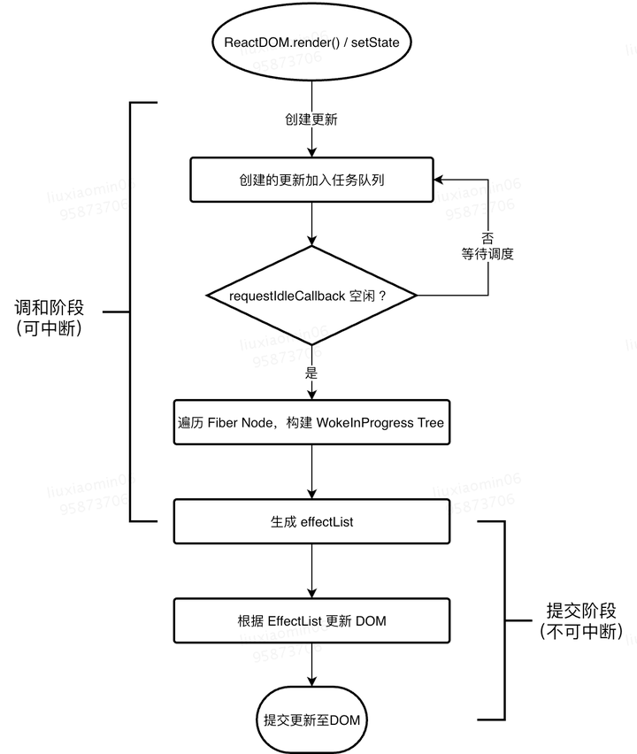

# react fiber
## 背景
 如果需要对比大量的虚拟节点，这将会造成主线程阻塞，页面卡顿。
## 定义
为了解决 React 在渲染过程中无法中断、无法复用渲染状态、无法立即执行的问题。
## fiber 原理
将渲染工作分割成块，将其分散到多个帧中,每个帧可以中断渲染，执行其他任务，然后继续渲染。
## fiber 工作流程
1. React.createElement 构建一个element树时，创建一个 虚拟dom树时，也创建一个 fiber tree

2. 调和阶段
 2.1 diff 算法生成 effect list，这个阶段react 为 每一个fiber 节点打上 增删改的标记
 2.2 这个阶段可以被中断，如果有更高优先级的任务（如： 用户交互），react 将中断当前渲染任务，执行更高等级的任务
 2.3 当所有fiber 阶段都遍历完毕，react 将effect list 传递给提交阶段
3. 提交阶段
 将effect list 一次性更新dom，进行UI 渲染
