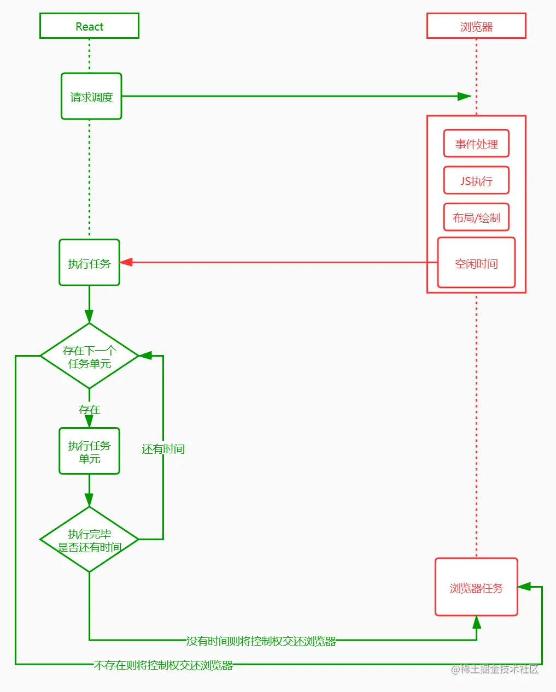

 # setState 后是如何更新Dom的
 1. setState后，react 会创建一个新的fiber树
 - fiber 节点是对应的react 组件，包含了组件的类型（函数组件还是类组件），props，state 信息
2. 调度更新，react 将新的state或者组件实例放入队列中，这个队列是基于fiber 节点的，择机更新
 - 队列的调度优先级，是用户交互高于网络请求的回调函数
3. react 会在合适的时机处理（当前调用栈完成后）处理更新队列，这就是fiber的核心“reconciliation”；
4. 生成fiber树，在3的处理过程中，某些fiber节点会被标注需要更新
5. commit过程，将需要更新的fiber节点，一次性更新到dom上。这个过程是同步的，会阻塞渲染

## 其他说明

更新过程的可控主要体现在下面几个方面：

任务拆分
任务挂起、恢复、终止
任务具备优先级

1. 任务拆分
前面提到，React Fiber 之前是基于原生执行栈，每一次更新操作会一直占用主线程，直到更新完成。这可能会导致事件响应延迟，动画卡顿等现象。
在 React Fiber 机制中，它采用"化整为零"的战术，将调和阶段（Reconciler）递归遍历 VDOM 这个大任务分成若干小任务，每个任务只负责一个节点的处理。例如：
javascript复制代码import React from "react";
import ReactDom from "react-dom"
const jsx = (
    

    A1
    

      B1
      
C1

      
C2

    

    
B2

  

)
ReactDom.render(jsx,document.getElementById("root"))

这个组件在渲染的时候会被分成八个小任务，每个任务用来分别处理 A1(div)、A1(text)、B1(div)、B1(text)、C1(div)、C1(text)、C2(div)、C2(text)、B2(div)、B2(text)。再通过时间分片，在一个时间片中执行一个或者多个任务。这里提一下，所有的小任务并不是一次性被切分完成，而是处理当前任务的时候生成下一个任务，如果没有下一个任务生成了，就代表本次渲染的 Diff 操作完成。

2. 挂起、恢复、终止
再说挂起、恢复、终止之前，不得不提两棵 Fiber 树，workInProgress tree 和 currentFiber tree。
workInProgress 代表当前正在执行更新的 Fiber 树。在 render 或者 setState 后，会构建一颗 Fiber 树，也就是 workInProgress tree，这棵树在构建每一个节点的时候会收集当前节点的副作用，整棵树构建完成后，会形成一条完整的副作用链。
currentFiber 表示上次渲染构建的 Filber 树。在每一次更新完成后 workInProgress 会赋值给  currentFiber。在新一轮更新时 workInProgress tree 再重新构建，新 workInProgress 的节点通过 alternate 属性和 currentFiber 的节点建立联系。
在新 workInProgress tree 的创建过程中，会同 currentFiber 的对应节点进行 Diff 比较，收集副作用。同时也会复用和 currentFiber 对应的节点对象，减少新创建对象带来的开销。也就是说无论是创建还是更新，挂起、恢复以及终止操作都是发生在 workInProgress tree 创建过程中。workInProgress tree  构建过程其实就是循环的执行任务和创建下一个任务，大致过程如下：

## 所以diff 算法的实现最后都是 fiber 的实现

# setState 是异步还是同步？
1. setState 是异步更新，同步执行，setState 在合成事件和钩子函数中是“异步”的，在原生事件和 setTimeout 中是同步的。
2. setState 的异步是通过批量更新实现的，会将多次更新合并成一次更新，减少重复渲染的次数
3. setState 的批量更新是基于事务的，如果在生命周期中调用setState，会立即更新，不会批量更新

setState 的“异步”并不是说内部由异步代码实现，其实本身执行的过程和代码都是同步的，只是合成事件和钩子函数的调用顺序在更新之前，导致在合成事件和钩子函数中不能直接拿到更新后的值，形成了所谓的“异步”，当然也可以通过 setState 的第二个参数 callback 的回调中拿到更新后的结果。
setState 的批量更新优化也是建立在“异步”（合成事件、钩子函数）之上的，在原生事件和 setTimeout 中不会批量更新，在“异步”中如果对同一个值进行多次 setState， setState 的批量更新策略会对其进行覆盖，取最后一次的执行，如果是同时 setState 多个不同的值，在更新时会对其进行合并批量更新。