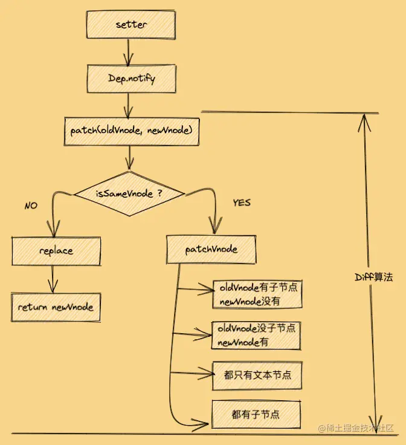

# 数据改变时，到dom更新时的流程
- 触发setter
- 触发 Dep.nofity，通知所有的订阅者watcher
- 订阅者调用 patch 给真实dom 打补丁


## patch 过程是比较同层的虚拟节点进行比较
```js
function patch(oldVnode, newVnode){
  if(isSameVnode(oldVnode, newVnode)){
    patchVnode(oldVnode, newVnode)
  }else{
    // 旧虚拟节点的真实dom节点
    const oldEl = oldVnode.el;
    // 通过真实的dom节点，获取其父节点
    const parentEl = api.parentNode(oldEl);
    // 创建新的真实dom节点, 如果这个过程中parentEl 存在的话，会直接挂载的
    createEle(newVnode)
    
    if(parentEl !== null){
      // 将新元素添加到父元素
      api.insertBefore(parentEl, newVnode.el, api.nextSibling(oEl));
      api.remove(parentEl, oldVnode.el);
      
      oldVnode = null;
    }
  }
  
}

function isSameVnode(oldVnode, newVnode){
  return (
    oldVnode.key === newVnode.key &&
      oldVnode.tagName === newVnode.tagName &&
      oldVnode.isComment === newVnode.isComment &&  // 是否都为注释节点
    isDef(oldVnode.data) === isDef(newVnode.data) && 
      sameInputType(oldVnode, newVnode)  // input 必须相同
  )
}

function patchVnode(oldVnode, newVnode){
    if(oldVnode === newVnode){
        return;
    }
    
    const elm = newVnode.el = oldVnode.el;
    
    let oldCh = oldVnode.children;
    let newCh = newVnode.children;
    
    // 如果新旧节点都是文本节点，且文本不一样
  if(oldVnode.text !== null && newVnode.text !== null && oldVnode.text !== newVnode.text){
    api.setTextContent(el, newVnode.text);
  }else{
    // 新旧的子节点都存在，且不一样
    if(oldCh && newCh && oldCh !== newCh){
      updateChildren(el, oldCh, newCh);
    }else if(newCh){
      // 新节点有，旧节点就没有
      createEle(newVnode);
    }else if(oldCh){
      // 旧有子节点，新没有子节点
      api.removeChild(el);
    }
  }
}

function updateChildren(parentElm, oldCh, newCh){
  let oldStartIdx = 0;
  let oldEndIdx = oldCh.length - 1;
  let oldStartVnode = oldCh[0];
  let oldEndVnode = oldCh[oldEndIdx];
  
  let newStartIdx = 0;
  let newEndIdx = newCh.length - 1;
  let newStartVnode = newCh[0];
  let newEndVnode = newCh[newEndIdx];
  
  let oldKeyToIdx, idxInOld, elmToMove, refElm;
  
  while(oldStartIdx <= oldEndIdx && newStartIdx <= newEndIdx){
    if(oldStartVnode === null){
      oldStartVnode = oldCh[++oldStartIdx];
    }else if(oldEndVnode === null){
      oldEndVnode = oldCh[--oldEndIdx];
    }else if(newStartVnode === null){
      newStartVnode = newCh[++newStartIdx];
    }else if(newEndVnode === null){
      newEndVnode = newCh[--newEndIdx];
    }else if(isSameVnode(oldStartVnode, newStartVnode)){
      patchVnode(oldStartVnode, newStartVnode);
      oldStartVnode = oldCh[++oldStartIdx];
      newStartVnode = newCh[++newStartIdx];
    }else if(isSameVnode(oldEndVnode, newEndVnode)){
      patchVnode(oldEndVnode, newEndVnode);
      oldEndVnode = oldCh[--oldEndIdx];
      newEndVnode = newCh[--newEndIdx];
    }else if(isSameVnode(oldStartVnode, newEndVnode)){
      patchVnode(oldStartVnode, newEndVnode);
      api.insertBefore(parentElm, oldStartVnode.el, api.nextSibling(oldEndVnode.el));
      oldStartVnode = oldCh[++oldStartIdx];
      newEndVnode = newCh[--newEndIdx];
    }else if(isSameVnode(oldEndVnode, newStartVnode)) {
      patchVnode(oldEndVnode, newStartVnode);
      api.insertBefore(parentElm, oldEndVnode.el, oldStartVnode.el);
      oldEndVnode = oldCh[--oldEndIdx];
      newStartVnode = newCh(++newStartIdx);
    }else{
      if(oldKeyToIdx === undefined){
        oldKeyToIdx = createKeyToOldIdx(oldCh, oldStartIdx, oldEndIdx);
      }
      idxInOld = oldKeyToIdx[newStartVnode.key];
        if(!idxInOld){
            createEle(newStartVnode);
            newStartVnode = newCh[++newStartIdx];
        }else{
            elmToMove = oldCh[idxInOld];
            if(elmToMove.sel !== newStartVnode.sel){
                createEle(newStartVnode);
            }else{
                patchVnode(elmToMove, newStartVnode);
                oldCh[idxInOld] = undefined;
                api.insertBefore(parentElm, newStartVnode.el, oldStartVnode.el);
            }
            newStartVnode = newCh[++newStartIdx];
        }
    }
  }
  if(oldStartIdx > oldEndIdx){
    before = newCh[newEndIdx + 1] === null ? null : newCh[newEndIdx + 1].el;
    addVnodes(parentElm, before, newCh, newStartIdx, newEndIdx);
  }else if(newStartIdx > newEndIdx){
    removeVnodes(parentElm, oldCh, oldStartIdx, oldEndIdx);
  }
}
```
