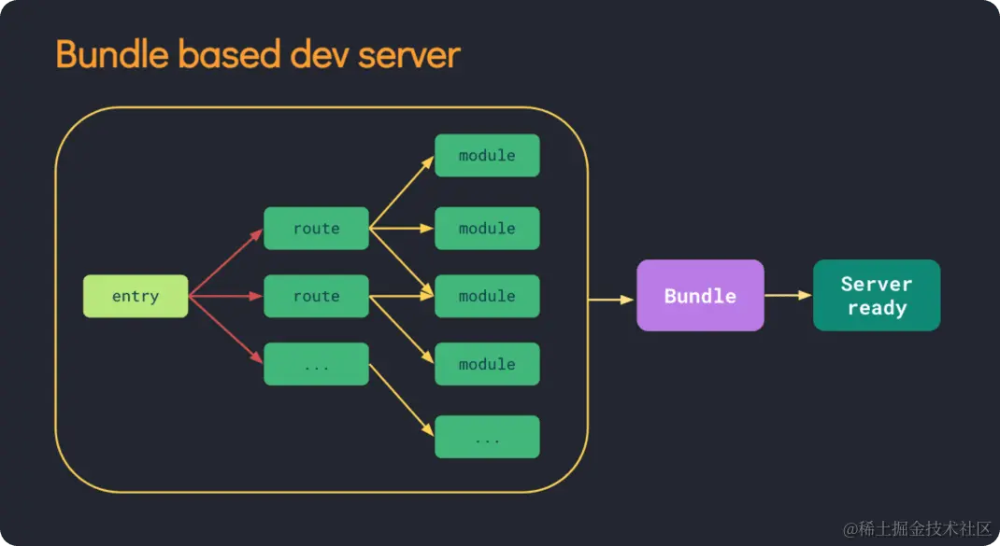
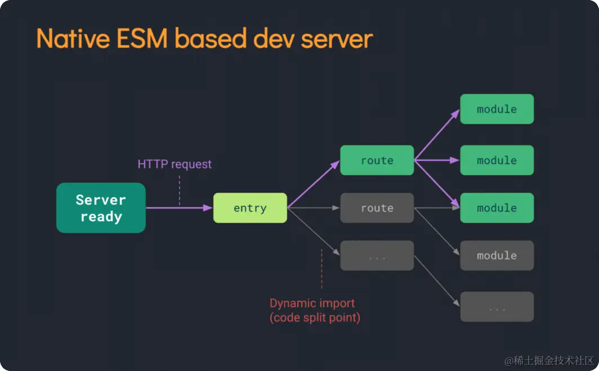

# vite 是如何构建的
1. 冷启动：

* 当你启动Vite开发服务器时，它会读取你的项目文件并构建一个基于原生 ES 模块的开发服务器。
* Vite不会像传统的打包工具那样将整个应用打包成一个巨大的文件，而是将每个模块都作为一个单独的文件。
* 在初次访问应用时，Vite会构建一个虚拟的服务端渲染（Server-Side Rendered）HTML页面，以实现快速的冷启动。
2. 模块预构建（Module Pre-Building）：

* 在开发过程中，Vite会对每个模块进行预构建。这意味着它会分析你的代码并生成一个优化的构建，以确保冷启动和HMR的速度。
* 与传统的打包工具不同，Vite只构建需要的模块，而不会构建整个应用。
3. HMR（热模块替换）：

* Vite利用原生 ES 模块的特性，通过浏览器的模块系统实现热模块替换。
* 当你修改了一个模块，Vite会将新的模块发送到浏览器，然后通过原生的模块系统进行更新，实现快速的热模块替换。
4. 生产构建：

* 当你准备部署应用时，Vite会生成一个生产环境的构建。
* 在生产构建中，Vite会将所有模块打包成一个或多个最终的生产文件，以确保在生产环境中的最佳性能。


# vite 为什么比webpack 快
Vite相对于Webpack的速度优势主要来自以下几个方面：

1. ES 模块原生支持：

* Vite使用原生 ES 模块来处理代码，而不是像Webpack一样通过Babel等工具将代码转换为CommonJS模块。
* 原生 ES 模块的特性允许在开发环境中更精确地分析和加载模块，从而加速冷启动和热模块替换。
2. 模块预构建：

* Vite通过分析代码的依赖关系，只构建当前需要的模块，而不是整个应用。
* 这种模块级别的构建策略大大减小了构建的范围，提高了构建速度。
3. HMR（热模块替换）的原生支持：

* Vite利用原生 ES 模块系统实现了更快速的热模块替换。
* HMR的实现是基于浏览器原生的模块加载器，而不是依赖于额外的运行时代码。
4. 更轻量的打包：

* Vite在开发环境下不进行打包，而是以原生 ES 模块的形式提供代码。这避免了传统Webpack开发环境下的繁重打包过程。
* 在生产环境中，Vite的打包也更加轻量，因为它遵循了传统的打包和代码分割策略，但在开发环境和HMR方面它更加高效。
5. 优秀的性能优化：

* Vite针对开发过程中的性能优化进行了精心设计，如快速的构建速度和低内存占用。
* 对于开发者来说，这意味着更短的构建时间和更高的开发效率。
总体而言，Vite的设计理念以及对现代前端工程化的创新性思考使其在开发环境下表现出色，特别适合大型项目和需要频繁构建的场景。然而，在生产环境下，Webpack仍然是一个强大且广泛使用的工具，因为它提供了更多的配置选项和一些Vite尚未涉及的功能。

## HMR 是如何工作的
webpack
webpack项目中，每次修改文件，都会对整个项目重新进行打包，这对大项目来说，是非常不友好的。
虽然webpack现在有了缓存机制，但还是无法从根本上解决这个问题。
vite
vite项目中，监听到文件变更后，会用websocket通知浏览器，重新发起新的请求，只对该模块进行重新编译，然后进行替换。
并且基于es module的特性，vite利用浏览器的缓存策略，针对源码模块（我们自己写的代码）做了协商缓存处理，针对依赖模块（第三方库）做了强缓存处理，这样我们项目的访问的速度也就更快了。


## 运行原理  对比
webpack

当我们使用webpack启动项目时，webpack会根据我们配置文件（webpack.config.js） 中的入口文件（entry），分析出项目项目所有依赖关系，然后打包成一个文件（bundle.js），交给浏览器去加载渲染。
这样就会带来一个问题，项目越大，需要打包的东西越多，启动时间越长。
vite 原理，以及vite 为什么快

基于浏览器支持的 <script type='module'>, 浏览器遇到import引用时，自动发起http请求，加载对应的模块
vite也正是利用了ES module这个特性，使用vite运行项目时，首先会用esbuild进行预构建，将所有模块转换为es module，不需要对我们整个项目进行编译打包，而是在浏览器需要加载某个模块时，拦截浏览器发出的请求，根据请求进行按需编译，然后返回给浏览器。

## 构建方式  对比
webpack
webpack是基于nodejs运行的，但js只能单线程运行，无法利用多核CPU的优势，当项目越来越大时，构建速度也就越来越慢了。
vite
vite预构建与按需编译的过程，都是使用esbuild完成的。
esbuild是用go语言编写的，可以充分利用多核CPU的优势，所以vite开发环境下的预构建与按需编译速度，都是非常快的。


## vite 基本配置
```js
import { defineConfig } from 'vite';

export default defineConfig({
  // 基本配置
  root: './',
  // 入口文件
  entry: './main.js',
  // 输出文件
  output: {
    filename: 'bundle.js',
  },
  // 模块解析器
  resolve: {
    extensions: ['.js', '.ts', '.vue'],
  },
  // 模块打包器
  build: {
    target: 'esnext',
  },
  // 开发服务器配置
  server: {
    port: 3000,
    // 开启热重载
    hot: true,
    // 开启 HMR
    hmr: true,
  },
  // 构建配置
  build: {
    // 输出文件格式
    format: 'esm',
    // 文件压缩
    minify: true,
    // 代码分割
    chunkSize: 10000,
  },
  // 环境变量配置
  env: {
    // 在开发环境中使用 DEBUG 变量
    DEBUG: process.env.NODE_ENV === 'development' ? 'true' : 'false',
  },
  // 其他配置
  plugins: [
    // 添加一个插件
    {
      name: 'my-plugin',
      // 配置插件
      options: {
        // ...
      },
    },
  ],
});

```