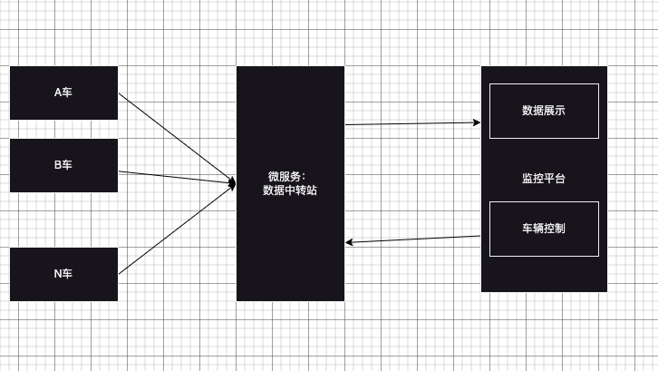

# 背景
- 前端100ms获取一次数据，每次获取的数据都是复杂、嵌套很深的结构体，如何优化页面渲染速度？

# 问题分析
## 数据流结构

## 数据结构体
车辆将类似与下面的数据（实际要比这个复杂同时嵌套的深）发送给微服务，微服务再将数据发送给前端
```ts
type Car={
 id: number,
 location: {x: number, y: number, z: number},
 speed: number,
 direction: 'east' | 'west' | 'south' | 'north', // 实际比这四个要复杂
  status: 'running' | 'stop' | 'idle' | 'offline',
  carTime: number; // 对时
  error: {
    code: number,
    msg: string,
  },
  // 以下是车辆的状态
  轮胎:{
    胎压: number,
    胎温: number,
    轮胎状态: '正常' | '异常',
    其他数据结构体，
  },
  电池:{
    电池电量: number,
    电池温度: number,
    电池状态: '正常' | '异常',
    其他电池结构体,
  },
  灯:{
    大灯:大灯结构体，
    转向灯:转向灯结构体，
    刹车灯:刹车灯结构体，
    ...
  }
  雷达:{
    前雷达:雷达结构体，
    后雷达:雷达结构体，
    ...
  }
  配送仓:{
    配送仓结构体，
    ...
  }
}
```
## 可以优化的点
1. 微服务是否可以将数据打平然后传给前端，减少前端匹配的深度
2. 参照http2.0 设计思路，只有第一次请求需要携带完整的数据（车辆启动时），后续的请求只需要携带变化的数据，这样结构体就会变得很简单，同时可以节省带宽和整个数据传输的时间
3. 是否可以采用字典的方式，整个域系统采用一份通用的字典
例如：车辆的左侧轮胎坏了，电机也出故障了，车辆发送的数据为
```ts
{
 id: 1,
  location: {x: 1, y: 1, z: 1},
  speed: 0,
  direction: 'east',
  status: 'stop',
  carTime: 123456789,
  error: [0x010001, 0x040001],  // 字典定义了0x010001为左侧轮胎坏了，0x040001为电机出故障了
  其他没有变化的雷达数据，车灯数据都不发了
}
]
```
4. 前端程序修改，每次拿过来的数据按照数据的权重进行渲染，权重高的先渲染，权重低的后渲染；
5. 前端按照页面的可视区域进行渲染，可视区域外的数据不渲染，当页面滚动到可视区域时再渲染， 按照4的权重应该对数据有一个排序。
6. 采用 requestAnimationFrame(updateAnimation);来优化动画性能
7. 100ms刷新一次是否有必要，之前对接硬件的时候，也遇到过抖动误判的情况，而且对于人眼而言，1s刷新和100ms区别不大，是否可以考虑webWorker的方式，将数据缓存到本地另外一个线程，然后每隔1s推动给 renderer线程，这样可以减少前端的渲染次数，同时也可以减少前端的计算量