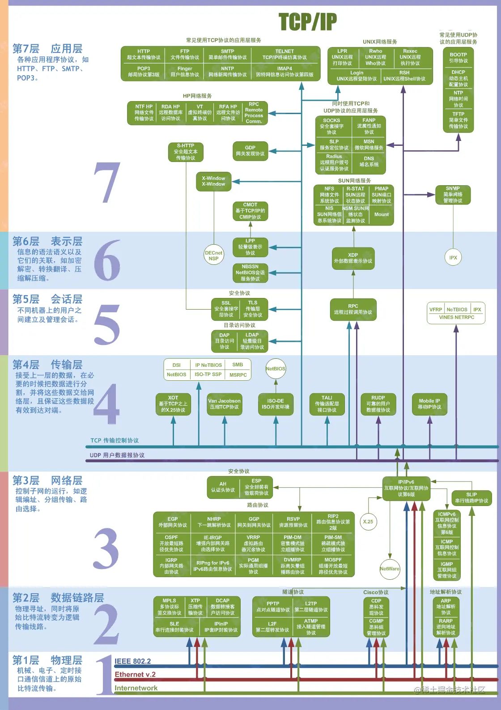
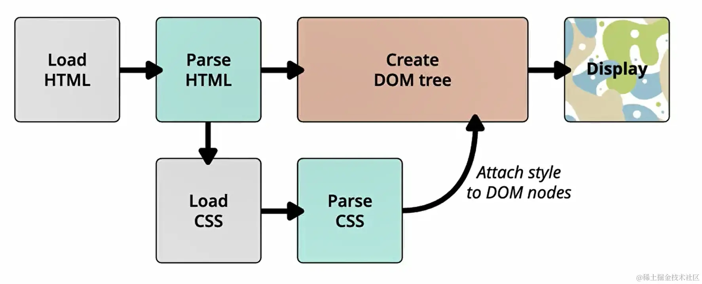

# 输入url到页面展示过程
1. 浏览器缓存，通过设置 cache-control:max-age=3600; 设置过期时间来处理
2. 协商缓存： last-modified（http1.0）, Etag(http1.1) 配置生效
3. 缓存位置： service-worker(一个独立的线程), memory-cache（内存中缓存，主要是一些下载的样式图片等，随着tab关闭释放）, disk-cache（磁盘缓存）, push-cache（推送缓存，http2.0）
4. 缓存走完了，没命中，需要域名解析。浏览器缓存查询=》本机host ip 查询=》路由器查询=》没有找到通过供应商 DNS IP 查询

## 网络协议图片

## 应用层
TCP/IP协议族的应用层协议有：FTP、HTTP、SMTP、POP3、Telnet、DNS等。这里有三次握手，四次挥手的过程
## 传输层

## 网络层

## 数据链路层
浏览器发送数据报文，

## 服务端接口相应并返回数据
这里会有一些状态码的返回，比如 200，301: 数据重定向，304: 协商缓存； 404， 500等

## 浏览器解析渲染页面
### 渲染流程图

1. 下载html文件, 解析html文件, 构建DOM树
2. 在解析html过程中，下载css文件，解析css文件，构建CSS对象模型（CSSOM）
3. 将DOM树和CSSOM树合并成一个渲染树
4. 在构建渲染树的过程中，会有布局和绘制的过程，  布局是计算元素的位置和大小尺寸，绘制是将元素绘制到屏幕上